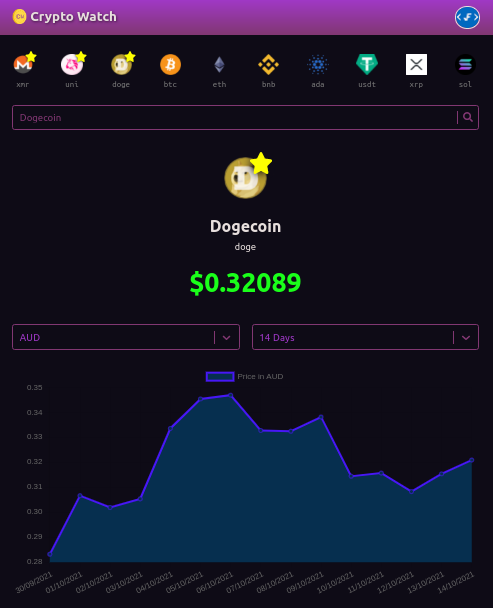

# Cryptocurrency Tracker

View the current and historical price of any cryptocurrency.

Login to save your favorite cryptocurrencies or setup price notifications.



## Live Demo

[react-crypto-watcher.netlify.app](https://react-crypto-watcher.netlify.app/)

## Description

Built with React.js and using data from [CoinGecko](https://www.coingecko.com/)'s [API](https://www.coingecko.com/api/documentations/v3).

The current top 10 [cryptocurrencies](https://en.wikipedia.org/wiki/Cryptocurrency) (by market cap) are displayed at the top of the page.

You can click one of the top 10 to see current it's current & historical price or search for
any other cryptocurrency by name using the search bar.

Once a cryptocurrency has been selected and it's data is displayed, you can change the fiat currency (eg. AUD)
that it is being compared to. You can also adjust the timeframe of the historical price chart to various lengths between 7 days and 1 year.

The current price of the chosen cryptocurrency will appear in red if it's less than it was yesterday or green if it's greater than yesterday's price.

### 'Favorites' Update (Oct. 2021):
You can [log in](https://react-crypto-watcher.netlify.app/sign-in) using email/password or using your Google, Facebook or Twitter account.

Once logged-in you will see a star icon overlayed on a cryptocurrency's logo while viewing it's details.

You can click the star icon to save the cryptocurrency you are viewing as a favorite.

You can remove the favorite by clicking the same star icon again.

Your favorite cryptocurrencies will be listed before any others in the navigation bar so you can view them quickly without having to search for them.

### 'Notifications' Update (Nov. 2021)
While logged-in, you can add or remove notifications from the notifications page.

Notifications which have had their thresholds met will be counted and reflected in the header button.

You can see a list of active notifications at the top of the notifications page.

## Running the App Locally

### Prerequisites

You will need Node.js which can be downloaded [here](https://nodejs.org/).

### Installation

1. Download or clone this repository.

   ```sh
   git clone https://github.com/Jimfarrugia/cryptocurrency-tracker.git
   ```

2. Navigate to the project's root folder and run the following command to install the required NPM packages.

   ```sh
   npm install
   ```

3. Start the development server by running the following command.

   ```sh
   npm run start
   ```

4. If it does not open automatically, open the application in your web browser at the following address:
   ```
   localhost:3000
   ```

### Contribution

Please feel free to submit issues and pull requests via Github if you'd like to contribute.

Any known bugs or publicly planned features can be found and can be found in the [issues page](https://github.com/Jimfarrugia/cryptocurrency-tracker/issues) of this repository.
